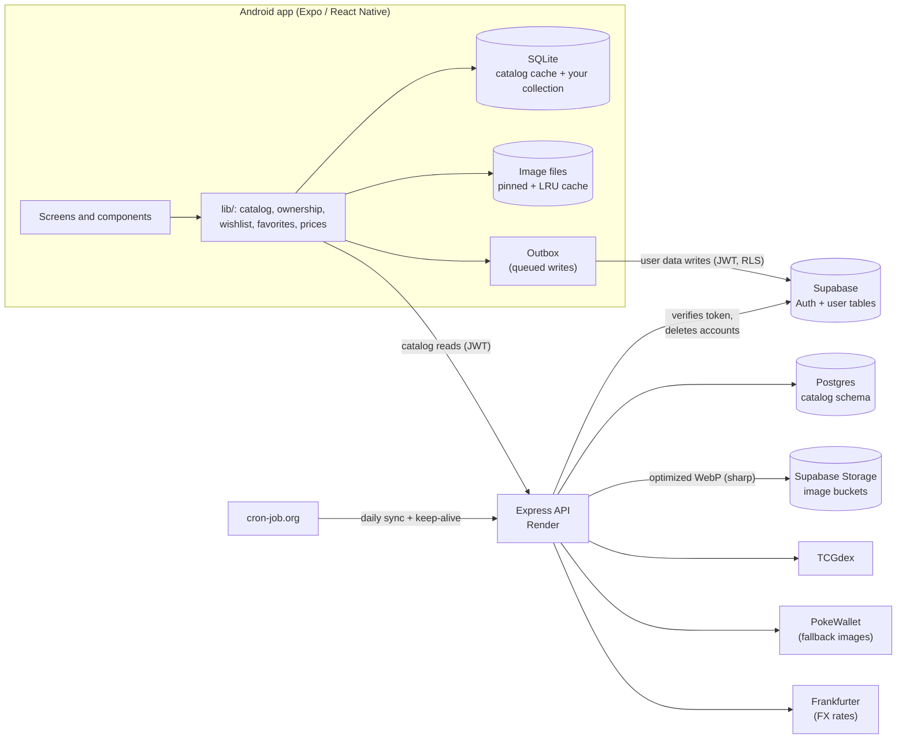

# Ember


## Overview

**Collect. Track. Complete.** Ember is a native Android Pokémon card collection tracker for collectors who want a proper digital record of the physical cards they own, instead of a spreadsheet.

Search any card, log exactly what you own (quantity, condition, variant, notes), keep a wishlist, browse every set and the whole Pokédex, and watch your completion progress and collection value grow. It keeps working offline and syncs your changes when you reconnect.

<p align="center">
  
</p>
<p align="center"><em>Browsing a set and adding a card to the collection.</em></p>

Ember is built with React Native (Expo SDK 57) on the front end, an Express/Node.js API on the back end, PostgreSQL for the shared card catalog, and Supabase for authentication and each user's private collection data.

> Ember is an unofficial fan project. Pokémon and Pokémon character names are trademarks of Nintendo, Creatures Inc. and GAME FREAK inc. It is not affiliated with or endorsed by them.

---

## Setup and installation

There are two ways to get Ember running:

- **[Option A: Install the released APK](#option-a-install-the-released-apk)** is the quickest way to try the app on an Android phone.
- **[Option B: Run it locally from source](#option-b-run-it-locally-from-source)** builds the whole stack yourself (Supabase project, Postgres catalog, Express server, Google sign-in, hosting and cron jobs).

### Option A: Install the released APK

**Requirements**

| Requirement | Details |
| --- | --- |
| Device | An Android phone or tablet. Ember targets Android only and is portrait-only. |
| Android version | Android 7.0 (API 24) or newer, which is the default minimum for Expo SDK 57. |
| Free storage | About 500 MB for the app, plus room for cached card images. |
| Internet | Required on first launch (to download the catalog) and for syncing. Anything you have already loaded works offline afterwards. |
| Browser | A default browser (such as Chrome) is needed for **Continue with Google**, which signs in through a browser tab. |
| Email app | Needed to open password-reset and email-change links. |
| Google account | Only if you want Google sign-in. Email and password sign-up works without one. |

**Steps**

1. On your phone, open the [Releases page](https://github.com/Lintahlo-001/Ember/releases) and download the latest `ember-x.y.z.apk`.
2. Android will ask for permission to install apps from outside the Play Store. Open **Settings → Apps → Special app access → Install unknown apps** (the exact path varies by manufacturer), choose the browser or file manager you used to download the file, and allow it.
3. Open the downloaded APK and tap **Install**. If Google Play Protect warns that the app is from an unknown developer, choose **Install anyway**. The APK is not distributed through the Play Store.
4. Open **Ember**, tap **Sign Up**, create an account, then log in.

**Updating:** download the newer APK and install it over the old one. Your collection is stored in your account, and your offline cache survives the update.

**Troubleshooting**

- *"Could not reach the server":* check your connection, wait a minute and tap **Try again**.
- *Google sign-in returns to the login screen:* make sure a default browser is installed, and finish the Google prompt without closing the tab.
- *Install blocked:* re-check the "Install unknown apps" permission for the app you opened the APK from.
- *Password reset link says it expired:* reset links are single-use and last one hour. Open the link on the same phone that has Ember installed, and request a new one if needed.

---

### Option B: Run it locally from source

This path sets up everything from scratch. Plan on roughly 1 to 2 hours, most of it waiting for the initial catalog sync.

#### B1. Prerequisites

| Tool / account | Why you need it |
| --- | --- |
| [Node.js 22+](https://nodejs.org) and npm | Runs the app tooling and the server (Render also uses Node 22). The server's image optimizer (`sharp`) needs Node 20.9 or newer. |
| [Git](https://git-scm.com) | Clone the repository. |
| An Android phone with **[Expo Go](https://play.google.com/store/apps/details?id=host.exp.exponent)** installed, **or** an Android Studio emulator | The main way to run the app. Expo Go from the Play Store must support Expo SDK 57. For an emulator, create a Pixel device image on API 24 or newer. |
| A [Supabase](https://supabase.com) account (free tier works) | Authentication, user data, the Postgres database and file storage. |
| A [Google Cloud](https://console.cloud.google.com) account | The OAuth client for Continue with Google. Optional if you only use email and password. |
| A [Render](https://render.com) account (free tier works) | Hosts the Express API so your phone can reach it from anywhere. Optional if you only test on your own network. |
| A [cron-job.org](https://cron-job.org) account (free) | Triggers the daily sync and keeps the free Render service awake. Optional for local-only use. |
| A [PokeWallet](https://pokewallet.io) API key (free tier) | Optional. Only needed for the missing-image fallback sweep. |
| An [Expo](https://expo.dev) account and `eas-cli` (`npm install -g eas-cli`) | Only needed to build a development client (for Google sign-in and password-reset links) or an APK. Not needed for Expo Go. |

If you use a physical phone, your phone and computer must be on the **same Wi-Fi network**, and your firewall must allow port 3000 (the API) and Expo's dev server port.

#### B2. Clone and install

```bash
git clone https://github.com/Lintahlo-001/Ember.git
cd Ember

# the Expo / React Native app (repo root)
npm install

# the Express server
cd server
npm install
cd ..
```

`npm install` installs everything listed in each `package.json`, so you do **not** need to install the packages below by hand. They are listed here because they are the newest server additions:

| Package | Where | What it is used for |
| --- | --- | --- |
| `sharp` | server | Resizes and converts every image Express uploads to Storage into optimized WebP (see [Image optimization](#image-optimization)). |
| `compression` | server | Gzips API responses larger than 1 KB, which matters for the big set and species lists. |
| `@types/compression` (dev) | server | TypeScript types for `compression`. |

If you are rebuilding the server from scratch or they ever go missing, add them with:

```bash
cd server
npm i sharp compression
npm i -D @types/compression
```

`sharp` downloads a prebuilt native binary for your OS, so there is nothing to compile. If you installed with `--ignore-scripts`, or you copy `node_modules` between machines, run `npm rebuild sharp`. On Render, the build command (`npm install --include=dev && npm run build`) already pulls the Linux binary.

The app itself relies on these native modules for offline support:

| Module | What it is used for |
| --- | --- |
| `expo-sqlite` | The on-device database (catalog cache, your collection, the outbox). It is also registered as a plugin in `app.json`. |
| `expo-file-system` | The on-device image cache. |
| `@react-native-community/netinfo` | Detects reconnects so queued changes sync automatically. |
| `@react-native-async-storage/async-storage` | Stores the Supabase session, small UI preferences and the onboarding flag. |

All four ship inside Expo Go, so you don't need to do anything extra. If you ever remove and re-add them, use `npx expo install expo-sqlite expo-file-system @react-native-community/netinfo @react-native-async-storage/async-storage` so Expo picks versions that match SDK 57. In a custom development build they need a rebuild whenever they are added.

#### B3. Create the Supabase project

1. In Supabase, create a **New project**. Pick a region close to you and save the database password somewhere safe.
2. **API keys:** open **Project Settings → API Keys**. You will need:
   - the **Project URL** (`https://<ref>.supabase.co`),
   - the **publishable key** (`sb_publishable_...`), which is safe to put in the app,
   - the **secret key** (`sb_secret_...`), which belongs **only** on the server. Never put it in the app or commit it. The server uses it for Storage uploads and for deleting accounts.
3. **Database connection string:** click **Connect** and copy the **Transaction pooler** string (port **6543**), then substitute your database password. Use the pooler, not the direct 5432 connection. Express opens many short-lived connections, and the free tier allows far more pooled than direct connections. Transaction mode does not support prepared statements, so don't enable them if you add an ORM later.
4. **Auth settings** (**Authentication → Sign In / Providers**):
   - Under **Email**, turn **Confirm email** **off**. Ember's Sign Up deliberately signs the user out and sends them to Log In, which expects an immediate session from `signUp()`.
   - Turn **Allow manual linking** **on**. The *Google account* row in My Account uses it to link and unlink Google.
   - Google itself is configured in step B5.
5. **Create the storage buckets** (**Storage → New bucket**). Create both as **public** buckets:
   - `catalog-fallbacks`: holds mirrored TCGdex images and PokeWallet fallback images (card images, set logos, symbols).
   - `rarity-icons`: holds your hand-made rarity icons (for example `double-rare.webp`).
6. **Run the SQL migrations** in **SQL Editor**, one file at a time, **in this order**. Every file is safe to re-run.

   | Order | File | What it creates |
   | --- | --- | --- |
   | 1 | `server/sql/001_catalog_schema.sql` | `catalog` schema, `sets` and `cards` tables, RLS on |
   | 2 | `server/sql/002_image_fallbacks.sql` | fallback image path / source / checked columns |
   | 3 | `server/sql/003_rarities.sql` | `catalog.rarities` plus the trigger that fills it automatically |
   | 4 | `server/sql/004_ownership.sql` | `public.ownership_entries` with RLS, and the merge RPC |
   | 5 | `server/sql/005_wishlist.sql` | `public.wishlist_entries` with RLS |
   | 6 | `server/sql/006_favorites.sql` | `public.favorite_sets` with RLS |
   | 7 | `server/sql/007_image_versioning.sql` | image ETag / version columns and the set-bump trigger |
   | 8 | `server/sql/007b_rarity_icon_version.sql` | rarity icon version columns |
   | 9 | `server/sql/007c_version_columns.sql` | `images_locked`, `logo_version`, `symbol_version` columns |
   | 10 | `server/sql/008_applied_ops.sql` | idempotency table and the final `add_ownership_entry` RPC |
   | 11 | `server/sql/009_pokemon_species.sql` | species and regions tables (regions are pre-filled) |
   | 12 | `server/sql/010_dex_inferred.sql` | `dex_inferred` flag on cards |
   | 13 | `server/sql/011_fx_rates.sql` | exchange-rate cache table |
   | 14 | `server/sql/012_purge_user_data.sql` | `public.purge_user_data(uuid)`, a `SECURITY DEFINER` function that deletes a user's ownership, wishlist, favorites and applied-ops rows. Executable by `service_role` only. Used by account deletion. |

   The `catalog` schema is intentionally **not** exposed through the Supabase API. Only the Express server reads it, over a direct Postgres connection. The `public` user tables are protected by Row Level Security so each user can only see and change their own rows.

#### B4. Configure environment variables

Copy both example files and fill them in.

```bash
cp .env.example .env
cp server/.env.example server/.env
```

**Root `.env`** (read by the Expo app; `EXPO_PUBLIC_*` values are bundled into the app, so only put public values here):

| Variable | Example | Purpose |
| --- | --- | --- |
| `EXPO_PUBLIC_SUPABASE_URL` | `https://xxxx.supabase.co` | Supabase project URL |
| `EXPO_PUBLIC_SUPABASE_PUBLISHABLE_KEY` | `sb_publishable_...` | Public client key (never the secret key) |
| `EXPO_PUBLIC_API_URL` | `http://192.168.1.20:3000` | Your Express API. Use your computer's LAN IP for a physical phone, `http://10.0.2.2:3000` for the Android emulator, or your Render URL once deployed. |

**`server/.env`** (read by Express and every job script; never expose these):

| Variable | Example | Purpose |
| --- | --- | --- |
| `SUPABASE_URL` | `https://xxxx.supabase.co` | Used to verify user tokens and reach Storage |
| `SUPABASE_PUBLISHABLE_KEY` | `sb_publishable_...` | Used to verify a user's JWT with `auth.getUser()` |
| `SUPABASE_SECRET_KEY` | `sb_secret_...` | Server-only key for Storage uploads and deletes, and for deleting user accounts |
| `DATABASE_URL` | `postgresql://postgres.<ref>:<password>@<host>.pooler.supabase.com:6543/postgres` | Transaction-pooler connection string |
| `PORT` | `3000` | Local server port |
| `NODE_ENV` | `development` | Environment flag |
| `CORS_ORIGINS` | `http://localhost:8081` | Comma-separated **browser** origins allowed by CORS. The native app sends none, so this only matters for web testing. |
| `POKEWALLET_API_KEY` | `pk_live_...` | Optional. Only the image fallback sweep needs it. |
| `CRON_SECRET` | *(64 hex characters)* | Protects `POST /internal/sync`. Must be at least 24 characters or the route stays disabled. |

Generate a strong cron secret:

```bash
node -e "console.log(require('crypto').randomBytes(32).toString('hex'))"
```

> Plain `http://` to your LAN works in Expo Go and development builds, but release builds (the APK) block cleartext traffic by default. Use your HTTPS Render URL for any APK you build.

#### B5. Set up Google sign-in (optional)

Email and password works without this section. **Continue with Google** (and linking Google from My Account) needs all of it, and it **does not work inside Expo Go** (see [How to run it](#how-to-run-it)).

1. **Google Cloud Console → APIs & Services → OAuth consent screen.** Create the consent screen and set the **App name** to `Ember`. Otherwise Google shows your raw project ID to users.
2. **Credentials → Create credentials → OAuth client ID.** Choose **Web application**. Under **Authorized redirect URIs** add Supabase's callback URL: `https://<your-project-ref>.supabase.co/auth/v1/callback`. Copy the **Client ID** and **Client secret**.
3. **Supabase → Authentication → Sign In / Providers → Google.** Enable it and paste the Client ID and Client secret.
4. **Supabase → Authentication → URL Configuration → Additional Redirect URLs.** Add `ember://` (the app's URL scheme), `ember://login` (for confirming email change), `ember://reset-password` (the **Forgot Password** email link opens this screen), and `ember://link-callback` (handles redirect if user tries to link already registered google accounts).
5. `app.json` already declares `"scheme": "ember"`, so no change is needed.
6. The sign-in code (`signInWithOAuth` plus `WebBrowser.openAuthSessionAsync`) is already wired up in `src/context/AuthContext.tsx`, and linking lives in `src/lib/account.ts`.

> Step 4's second and third URL are needed even if you skip Google, because password-reset and email change confirmation links use it. Like Google sign-in, reset and confirmation links need a development build or the APK, since Expo Go can't receive the `ember://` scheme.

#### B6. Deploy the API to Render (optional for local-only use)

1. Push your fork to GitHub.
2. In Render, choose **New → Blueprint** and select the repo. Render reads `render.yaml` (service `ember-api`, Node 22, region Singapore, free plan, root directory `server`, health check `/health`, auto-deploy on). Alternatively create a **Web Service** by hand with the same settings: build command `npm install --include=dev && npm run build`, start command `npm start`.
3. Enter the environment variables marked `sync: false` in the dashboard: `SUPABASE_URL`, `SUPABASE_PUBLISHABLE_KEY`, `SUPABASE_SECRET_KEY`, `DATABASE_URL`, `POKEWALLET_API_KEY`, `CORS_ORIGINS`, `CRON_SECRET`. (`NODE_VERSION` and `NODE_ENV` are already set by `render.yaml`.)
4. Deploy, then open `https://<your-service>.onrender.com/health`. You should see `{"status":"ok", ...}`. Put this URL in `EXPO_PUBLIC_API_URL`.
5. Free-tier services sleep after about 15 minutes of inactivity, and the first request afterwards can take up to a minute. The keep-alive job in step B8 prevents this.
6. Render's own cron jobs are a paid feature, which is why the daily sync is triggered from cron-job.org instead (the Render cron block in `render.yaml` stays commented out).
7. The free instance has limited memory. The server keeps `sharp` to one thread with a small cache for this reason, but run the heavy image jobs (`mirror`, `sweep`) from your own machine rather than a Render shell.

#### B7. Fill the database

The server mirrors TCGdex into Postgres. Run these from `server/`. They connect using `server/.env`, so to fill your **production** database from your own machine, point `DATABASE_URL` at it. Every flag is explained in the [jobs reference](#server-jobs-reference).

```bash
cd server

# 1. Seed Pokémon species + descriptions from PokeAPI (~1,025 requests, safe to re-run)
npm run seed:species

# 2. Discover every set and its brief cards, then fetch the first 3,000 card details
npm run sync

# 3. Fetch every remaining card's full details (uncapped, safe to Ctrl-C and re-run)
npm run backfill

# 4. Optional safety net: infer Pokédex IDs for Pokémon cards TCGdex gave none for
npm run backfill:dex -- --dry-run     # preview first
npm run backfill:dex

# 5. Optional: remove empty sets / the TCG Pocket series
npm run purge:empty -- --dry-run
npm run purge:excluded -- --dry-run

# 6. Optional: upload your rarity icons / icons are already provided, but you can add your own
npm run upload:rarities -- ../assets/images/rarity-icons --dry-run
npm run upload:rarities -- ../assets/images/rarity-icons

# 7. Optional: mirror TCGdex images into your own bucket (uses Supabase storage space)
npm run mirror -- --dry-run
npm run mirror

# 8. Baseline image versions so future art changes are detected
npm run recheck:images -- --limit=20000

# 9. Optional: fetch missing images from PokeWallet (needs POKEWALLET_API_KEY, rate-limited)
npm run sweep -- --limit=500
```

Notes:

- The first `sync` and `backfill` make one request per set and per card, so they take a while. Both are resumable.
- **Rarity icons** are matched by file name: `Double rare` ↔ `double-rare.webp`, `Illustration rare` ↔ `illustration-rare.png` (`.webp` and `.png` accepted). Rarity names appear in `catalog.rarities` automatically as cards are synced, and the upload script prints which rarities still have no icon. A rarity without an icon shows as plain text in the app, so this step is optional. Rarity icons are uploaded as-is and are **not** run through the image optimizer.
- **Free-tier storage:** Supabase's free plan includes 1 GB of storage. Because every image is now optimized to WebP on upload, the mirror is much smaller than before, but a full mirror can still get large. Use `--set` / `--exclude-set` to limit it, or skip it and let the app load images straight from TCGdex. Use `purge:mirror` to free space.

##### Image optimization

Every file that goes through `uploadFallback()` (the `mirror` and `sweep` jobs, `replace:image`, and the daily image recheck for mirrored cards) is resized and converted to WebP by `server/src/imageOptimize.ts` before it reaches the bucket:

| Kind | Chosen by path | Max width | WebP quality |
| --- | --- | --- | --- |
| Card image | default | 800 px | 82 |
| Set logo / symbol | path contains `logo` or `symbol` | 600 px | 85 |
| Icon | path contains `rarity` | 128 px | 90 |

Images are never enlarged, an already-small WebP is kept if re-encoding would make it bigger, inputs over 50 megapixels are rejected, and if `sharp` fails for any reason the original bytes are uploaded instead (a warning is logged). Only **new** uploads are optimized. Images already in your bucket stay as they were. To re-optimize mirrored TCGdex images, free them and mirror again:

```bash
npm run purge:mirror -- --all --dry-run
npm run purge:mirror -- --all
npm run mirror
```

PokeWallet fallback images are never touched by `purge:mirror` (they may be the only copy), so replace those individually with `replace:image` if you want them optimized.

#### B8. Set up the cron jobs

Two [cron-job.org](https://cron-job.org) jobs keep the backend fresh and awake. The sync route is already mounted in `server/src/index.ts` **above** `app.use(requireAuth)`, so it is protected by the shared secret rather than a user token:

```ts
app.use(internalSyncRouter);   // secret-protected, sits above requireAuth
app.use(requireAuth);
app.use(accountRouter);
app.use(catalogRouter);
```

1. **Generate a secret** (see B4) and store it as `CRON_SECRET` in three places: the Render dashboard (**Environment**), `render.yaml` (`- key: CRON_SECRET`, `sync: false`), and `server/.env.example` (as `CRON_SECRET=generate-a-long-random-string`). The route stays **disabled** (it always returns 401) unless the secret is at least 24 characters long.
2. **Deploy**, then test the route:

   ```bash
   curl -i -X POST https://<your-service>.onrender.com/internal/sync
   # expect: 401 Unauthorized

   curl -i -X POST https://<your-service>.onrender.com/internal/sync \
     -H "Authorization: Bearer <your secret>"
   # expect: 202 {"status":"started"}
   ```

   Send the second request twice in quick succession. The second should return `409 Sync already running`. The sync runs in the background, and its result appears in Render's **Logs** tab as `Sync done in …s: …`.
3. **Daily sync job** on cron-job.org:
   - URL: `https://<your-service>.onrender.com/internal/sync`
   - Schedule: once a day, at an hour when you're asleep. TCGdex prices only update once a day at the source anyway.
   - Advanced: request method `POST`, with the header `Authorization: Bearer <your secret>`.
   - Turn on failure notifications.
4. **Keep-alive job** on cron-job.org:
   - URL: `https://<your-service>.onrender.com/health`
   - Schedule: every 10 minutes
   - Request method `GET`, no headers. `/health` is public on purpose.

---

## How to run it

Run the server and the app in two separate terminals.

**1. Start the backend** (skip this if you deployed to Render and set `EXPO_PUBLIC_API_URL` to its URL)

```bash
cd server
npm run dev
```

Confirm it's up at `http://localhost:3000/health`. It should return `{"status":"ok","dbTime":"..."}` once it can reach Postgres through the pooler.

**2. Start the app with Expo Go**

```bash
npm start
```

This runs `expo start --go`, which prints a QR code. Open **Expo Go** on your Android phone and scan it, or press `a` in the terminal to open the app on a connected device or emulator. Everything works in Expo Go except Google sign-in/linking and the password-reset email link, because both come back through Ember's custom `ember://` URL scheme, which only a real build can receive.

**3. Optional: a development build, for Google sign-in and password reset links**

Make the repo your own first. `app.json` currently points at the original author's Expo account, so change `expo.owner`, `android.package` (for example `com.yourname.ember`), and run `eas init` to create your own `extra.eas.projectId`. Then give EAS your public keys. `.env` is gitignored, so cloud builds can't see it:

```bash
eas login
eas env:create --name EXPO_PUBLIC_SUPABASE_URL --value "https://xxxx.supabase.co" --environment development --environment preview --environment production --visibility plaintext
eas env:create --name EXPO_PUBLIC_SUPABASE_PUBLISHABLE_KEY --value "sb_publishable_..." --environment development --environment preview --environment production --visibility plaintext
eas env:create --name EXPO_PUBLIC_API_URL --value "https://<your-service>.onrender.com" --environment development --environment preview --environment production --visibility plaintext
```

Build and install the development client, then start Metro in dev-client mode:

```bash
eas build --profile development --platform android
npx expo start --dev-client
```

**4. Optional: build an installable APK** (this is what a release looks like)

```bash
eas build --profile preview --platform android
```

The `preview` profile in `eas.json` produces an `.apk` for internal distribution. Attach it to a GitHub Release.

### Server jobs reference

All jobs live in `server/src/jobs/` and run with `npm run <script>` from `server/`. Arguments go after `--`. They use `server/.env`, so running one on your machine affects whichever database `DATABASE_URL` points to. Scripts ending in `:prod` run the compiled `dist/` output (after `npm run build`), for example inside a Render shell.

| Script | What it does | When to run it |
| --- | --- | --- |
| `npm run sync` / `sync:prod` | The **daily sync**. Discovers new or changed sets, backfills up to 3,000 missing card details, refreshes up to 500 cards older than 24 h, restores fallback logos that TCGdex now serves, re-checks 1,000 images for art changes (mirrored images are re-downloaded and re-optimized if they changed), and refreshes FX rates. The same work runs over HTTP via `POST /internal/sync`. | Daily (automated by cron-job.org). Run manually for the initial fill or to force a refresh. It does **not** run PokeWallet sweeps. |
| `npm run backfill` / `backfill:prod` | **Uncapped** backfill of full card details (rarity, illustrator, variants, pricing, dex IDs) for every card that only has brief data. Safe to Ctrl-C and re-run. | Once after the first `sync`, or after a big new set lands. |
| `npm run seed:species` | Fills `catalog.pokemon_species` from PokeAPI (name, slug, latest English description). Idempotent. | Once before the first `backfill`, and again only if new Pokémon are released. |
| `npm run backfill:dex` / `backfill:dex:prod` | Infers Pokédex IDs for Pokémon cards TCGdex gave none for. `--dry-run` previews matches and unmatched names, `--redo` re-evaluates previously inferred rows. Never overwrites a real TCGdex dex ID. | After seeding species, or after tuning the matcher. |
| `npm run mirror` | Copies TCGdex card images, set logos and set symbols into the `catalog-fallbacks` bucket (under `tcgdex/`), optimizing each to WebP. Flags: `--dry-run`, `--sets-only`, `--cards-only`, `--limit=N`, `--card-size=low`, `--set=a,b`, `--exclude-set=a,b`. Only rows with no stored path are touched, so it's resumable. | Optional. Run once to serve images from your own storage, and again after new sets are added. |
| `npm run purge:mirror` | Deletes mirrored `tcgdex/` files and clears their DB paths so the API serves TCGdex URLs again. PokeWallet files are never touched. **Requires** `--set=`, `--exclude-set=` or `--all`. Flags: `--dry-run`, `--cards-only`, `--sets-only`. | To reclaim bucket space, or before re-mirroring to re-optimize. Dry run first. |
| `npm run sweep` | The **PokeWallet fallback**. Fills missing card images and set logos from PokeWallet (optimized on upload). Self-limits to 90 requests per run (the free tier allows 100/hour and 1,000/day). Rows that miss are skipped for 7 days. Flags: `--limit=N`, `--cards-only`, `--debug`, `--debug-set=<id>`, `--find-set=<keyword>`. | Manually, when you notice cards or logos with no image. Re-run each hour to continue a backlog. |
| `npm run recheck:images` | Conditionally re-fetches card images (ETag / Last-Modified) and bumps `image_version` when art really changed. `--limit=N`. | Once as a baseline after the first fill. The daily sync keeps it current. |
| `npm run replace:image` | Manually replaces one image with a WebP file: `-- --card=swsh3-136 ./fixed.webp` or `-- --set=swsh3 --kind=logo ./logo.webp` (`logo` or `symbol`). The file is optimized on upload. Card replacements lock the row so the daily recheck won't overwrite them. | To fix a bad or wrong image by hand. |
| `npm run upload:rarities` | Uploads rarity icons from a folder, matched to rarity names by file name. Skips unchanged files by content hash. `--dry-run` supported. Not run through the image optimizer. | Whenever you add or change a rarity icon. |
| `npm run purge:empty` | Deletes sets that have zero cards, plus their bucket files. `--dry-run` supported. | After a sync that discovered empty sets. Don't run while a sync is in progress. |
| `npm run purge:excluded` | Deletes sets from excluded series (currently TCG Pocket, `tcgp`) and their files. `--dry-run` supported. | Once, if excluded sets slipped in. |

Typical order for a brand-new database: `seed:species` → `sync` → `backfill` → (`backfill:dex`) → (`upload:rarities`) → (`mirror`) → `recheck:images` → (`sweep`). After that, the daily cron job takes over.

---

## Features and usage

### Features for users

- **Accounts:** sign up and log in with email and password, or continue with Google. **Forgot Password** emails a reset link that opens a Set New Password screen in the app.
- **Onboarding hint:** the first time you open the Dashboard, a short three-step walkthrough shows how to find a card, mark it as owned and watch progress grow. Replay it any time from Settings.
- **Dashboard:** a searchable list of every card set, grouped by series (Mega Evolution, Scarlet & Violet, and so on). Each set shows owned/total and percent complete. Series collapse and expand, and your favorited sets are pinned in a Favorites group at the top.
- **Card search:** type a card name and get live suggestions for card names and artists. Submitting opens Search Results, where you can sort, filter and change the grid density.
- **Set Detail:** set logo, release date, estimated value, progress bar and a full card grid. Tap the star to favorite a set, or tap the header box to open the set's rarity breakdown.
- **Card Detail:** large card art (tap to zoom), the Pokémon on the card, the artist, a price pill, a wishlist heart and a **Your Collection** section.
- **Collection tracking:** a card can have several entries, each with its own quantity, condition (Near Mint to Damaged), variant (Normal, Reverse Holo, Holo, and so on) and optional notes. Adding the same variant and condition again merges the quantities. At quantity 1 the minus button becomes a delete button.
- **Pricing:** market price on every card, plus a Pricing Details sheet with TCGplayer and Cardmarket tabs and Market / Low / Mid / High per variant. Prices are shown in your chosen currency (PHP, USD, CAD, EUR, GBP, AUD, CNY, JPY or KRW).
- **My Cards:** everything you own, grouped by series and set, with Total Cards and Estimated Value, search, sort, filter and a 3 / 4 / 5 column switcher.
- **Wishlist:** tap the heart on any card. The tab shows how many cards you are hunting for.
- **Pokédex:** all Pokémon with National or regional views (Kanto to Paldea), search by name or number, owned/total progress, and a Pokémon Detail page listing every card ever printed of that Pokémon.
- **Statistics:** Unique Cards and Pokémon progress bars, your Top 5 Most Valuable cards (in your display currency) and Series Progress. Tapping a set opens **Set Breakdown**, which shows owned/total and a progress bar for each rarity, with rarity icons where you have uploaded them.
- **Sort and filter everywhere:** sort by number, name, price or illustrator. Filter by ownership (All / Owned / Not Owned) and by one or more rarities.
- **Display preferences:** all stored on the device, in Settings.
  - *Dim cards I don't own* and *Dim Pokémon I haven't collected* fade unowned items in lists and the Pokédex.
  - *Quick add on cards* shows or hides the **+** on cards you don't own.
  - *Owned badge on cards* and *Owned badge in Pokédex* show or hide the check mark on owned items.
- **Account management:** My Account lets you change your username, change your email (password accounts; Supabase emails a confirmation link and the change applies once you open it), change your password or **set** one if you signed up with Google, link or unlink your Google account, and delete your account.
- **Reset your data:** Settings can **clear every owned card** or **clear your whole wishlist** from your account on all devices. Both need an internet connection, push any pending changes first, and ask for confirmation.
- **Delete account:** removes your account and everything in it (owned cards, wishlist, favorites) from all your devices. You confirm by typing `DELETE` (plus your current password if you have one).
- **Works offline:** browse, add, edit and delete entries, and wishlist cards with no connection. Changes queue on the device and sync automatically when you are back online. Set and Card details need to be cached first.
- **Settings:** currency, display preferences, manual refresh of cached data, clearing the image cache, replaying the onboarding hint, credits, version, clear owned cards / wishlist, account management and log out. A dot on the gear icon tells you when an update is available.

### Technical features

- **Two separate data systems.** The public card catalog (same for everyone) lives in Postgres behind Express. Private user data (ownership, wishlist, favorites) lives in Supabase behind Row Level Security. The app never calls TCGdex or PokeWallet directly.
- **Postgres mirror cache.** TCGdex data is synced into a `catalog` schema. Set discovery, card detail backfill, stale-card refresh and FX refresh run in one daily job.
- **Three-tier image sourcing.** TCGdex image, then a PokeWallet fallback, then a "No image" placeholder. Fallback images swap back to TCGdex automatically when TCGdex adds them.
- **Server-side image optimization.** `sharp` resizes and re-encodes every uploaded card image, logo and symbol to WebP (see [Image optimization](#image-optimization)), cutting bucket size and download time. Responses from the API are gzipped with `compression`.
- **Image versioning.** Every image URL carries a `?v=` content version, and cards are re-checked daily with conditional requests (ETag / Last-Modified), so changed art propagates without re-downloading everything.
- **Offline-first client.** SQLite (WAL mode) holds sets, cards, details, Pokédex data, prices and your collection. Reads are cache-first, with background refreshes.
- **Local statistics.** Statistics and Set Breakdown are computed on the device from SQLite and the cached catalog, so they work offline and need no extra API route.
- **Outbox sync engine.** Writes go to SQLite first, then to an ordered outbox. Wishlist and favorites coalesce to the last desired state, and edits fold into pending operations. An idempotent `add_ownership_entry` RPC (operation IDs plus an advisory lock) means a retried request can never double-add. Offline, auth and 5xx failures pause the queue. Real rejections roll back and tell the user.
- **Image cache.** Files are stored on the device and pinned for owned and wishlisted cards, set logos and symbols, and rarity icons. Everything else is LRU-evicted past 300 MB. 404s are remembered for 7 days.
- **Dex inference.** When TCGdex gives no Pokédex ID, Ember matches the card name against a seeded species table (longest whole-word match, tag-team cards split on " & ").
- **Currency conversion.** USD-based ECB rates from Frankfurter are cached server-side (12 h) and on the device (24 h), and every price is converted at display time.
- **Update checks.** Once per 24 hours the app compares per-set timestamps with the server and only flags "update available". Nothing downloads until you press Refresh.
- **Account deletion pipeline.** `DELETE /account` (authenticated) calls the `purge_user_data` database function, then deletes the auth user with the server-only secret key. The app then wipes its local data and signs out.
- **Preferences.** Display toggles live in a small external store backed by AsyncStorage (`ember.prefs.v1`), so changing one updates every list instantly.
- **Accessibility.** 48dp minimum touch targets (via `hitSlop` where the visual is smaller), `Pressable` with `accessibilityRole`, a visible label on every input, 4.5:1 contrast pairings, and state is never shown by color alone (owned, wishlisted and favorited states also change the icon).
- **Design tokens.** All colors, fonts, spacing, breakpoints and accessibility minimums live in `src/theme/theme.ts`, built on plain `StyleSheet` with no styling-library dependency.
- **Security.** Auth-gated API with a cached token check, CORS allow-list, validated input on every route, parameterized SQL, a secret-protected cron endpoint, and RLS on every user table. See [Security](#security).

### How to use

1. **Create an account.** Open Ember, tap **Sign Up**, enter a username, email and password (or use **Continue with Google**), then log in. A short hint walks you through the basics the first time you reach the Dashboard.
2. **Find your cards.** Use the search bar on the Dashboard (suggestions appear as you type) or open a set from the Card Sets list. The Pokédex tab lets you start from a Pokémon instead.
3. **Add a card.** Tap the **+** on a card, or open it and tap **+** under *Your Collection*. Choose quantity, condition and variant, add optional notes, then tap **Add**. A check mark replaces the **+** once you own a card.
4. **Edit or remove entries.** On Card Detail, tap an entry to edit it, use the stepper to change the quantity, or press minus at 1 to delete it.
5. **Wishlist.** Tap the heart on Card Detail. Find everything in the Wishlist tab.
6. **Check prices.** Tap the price pill on Card Detail for the TCGplayer / Cardmarket breakdown. Change your display currency in **Settings**.
7. **Track progress.** Dashboard set cards show owned/total, the Pokédex shows Pokémon progress, **My Cards** shows your total value, and **Statistics** shows the big picture. Tap a set in Series Progress for its rarity breakdown.
8. **Sort, filter, resize.** Use the Sort and Filter pills, and the grid button cycles 3 → 4 → 5 columns.
9. **Tune the look.** In **Settings**, dim unowned cards or Pokémon, and hide the quick-add **+** or the owned check marks if you prefer cleaner grids.
10. **Go offline.** Everything you have viewed or own stays available. Changes sync when you reconnect.
11. **Stay up to date.** When a dot appears on the Dashboard gear icon, open **Settings → Refresh cached data** to pull new sets, price and image changes.
12. **Manage your account.** **Settings → My Account** handles username, email, password, Google linking and account deletion. Forgot your password? Use **Forgot Password?** on the Log In screen.

---

## Project structure

```
Ember/
├── assets/
│   ├── fonts/                        # Anton, Work Sans
│   ├── images/                       # app icons, splash, rarity icons
│   └── readme/                       # README screenshots + demo GIF
├── src/
│   ├── app/                          # expo-router file-based routes
│   │   ├── index.tsx                 # redirects by auth state
│   │   ├── _layout.tsx               # root stack, fonts, splash, image cache init
│   │   ├── reset-password.tsx        # opened by the password-reset email link
│   │   ├── (auth)/                   # welcome, login, signup, forgot-password
│   │   ├── (tabs)/
│   │   │   ├── _layout.tsx           # floating NavBar, Android back handling
│   │   │   ├── dashboard/            # index, my-cards, statistics, search-results,
│   │   │   │   ├── set-detail/[setId].tsx
│   │   │   │   ├── set-breakdown/[setId].tsx
│   │   │   │   ├── card-detail/[cardId].tsx
│   │   │   │   └── settings/         # index, credits, my-account/
│   │   │   │       └── my-account/   #   index, change-username/email/password, delete-account
│   │   │   ├── wishlist/             # index + card-detail/[cardId].tsx
│   │   │   └── pokedex/              # index + pokemon-detail/[pokemonId].tsx + card-detail
│   │   └── modals/                   # ownership-entry, pricing-detail (bottom sheets)
│   ├── components/
│   │   ├── atoms/                    # Button, Icon, IconButton, TextInput, Dropdown, ProgressBar,
│   │   │   └── icons/                #   CardImage, LogoImage, PokemonImage, placeholders, custom SVG icons
│   │   ├── molecules/                # FormField, SearchBar, SortFilterBar, Pill, CardThumbnail, SetCard,
│   │   │                             #   StatBox, ProgressRow, RankedCardRow, SettingsRow, ToggleRow,
│   │   │                             #   AccountCard, QuantityStepper, ActionDialog, ConfirmDialog...
│   │   ├── organisms/                # NavBar, CardGrid, SeriesGroup, CardDetailHeader, PillActionRow,
│   │   │                             #   YourCollectionSection, EntryModalForm, SetDetailHeader,
│   │   │                             #   PriceGrid, AccountForm, OnboardingHint...
│   │   └── layout/                   # Screen (safe-area wrapper)
│   ├── context/AuthContext.tsx       # Supabase session + sync start-up
│   ├── hooks/                        # useAllOwned, useCardListView, useCurrency, useCachedImage,
│   │                                 #   useStatistics, ...
│   ├── lib/                          # api, catalog, db (SQLite), sync + outbox, ownership, wishlist,
│   │                                 #   favorites, imageCache, currency, prices, refresh, updateCheck,
│   │                                 #   userScope, series, cardList, stats, pokedex, format, supabase,
│   │                                 #   account, preferences, dataReset, onboarding, logout
│   ├── screens/                      # CardDetailScreen, PokemonDetailScreen (shared across tab stacks)
│   └── theme/theme.ts                # design tokens
├── server/
│   ├── sql/                          # numbered migrations (001 to 012, plus 007b and 007c)
│   └── src/
│       ├── index.ts                  # Express app, middleware (CORS, gzip, body limits), route mounting
│       ├── auth.ts                   # requireAuth (Supabase JWT check + 60 s cache)
│       ├── db.ts                     # pg Pool (Supabase pooler)
│       ├── storage.ts                # Supabase Storage helpers (uploads go through the optimizer)
│       ├── imageOptimize.ts          # sharp: resize + WebP conversion
│       ├── tcgdex.ts, pokewallet.ts  # third-party API clients
│       ├── sync.ts, imageRecheck.ts  # catalog sync and image versioning
│       ├── dexInference.ts, suggest.ts, fx.ts
│       ├── routes/                   # catalog, pokedex, pricing, account, internalSync
│       └── jobs/                     # CLI jobs (see Server jobs reference)
├── app.json                          # Expo config
├── eas.json                          # EAS build profiles (development, preview APK, production)
├── render.yaml                       # Render blueprint for the API
├── AI-USAGE.md                       # record of how AI was used
├── SECURITY-CHECKLIST.md             # security audit checklist
└── .env.example
```

---

## Architecture



**Two data systems that never mix directly.**

1. **Public catalog (same for everyone).** Express syncs TCGdex into a Postgres `catalog` schema, so users are served from our copy rather than hitting TCGdex repeatedly. The schema has RLS enabled with no policies and revoked grants, and it is never exposed through the Supabase API. Only Express, using a direct connection, can read it. A daily job discovers new sets, backfills details, refreshes stale prices and re-checks images. Pokémon artwork is the one exception to "the app never calls a third party": artwork URLs point at the PokeAPI sprites repository and are then downloaded once and cached on the device.
2. **Private user data (per user).** Ownership entries, the wishlist and favorite sets live in Supabase `public` tables protected by RLS (`auth.uid() = user_id`). The app writes to them directly with the user's JWT, and there is no Express write route. There is deliberately no foreign key from user data to the catalog, so a catalog re-sync can never cascade into someone's collection. The single exception is account deletion, which goes through Express because removing an auth user needs the server-only secret key.

**Offline-first client.**

- The app reads the SQLite cache first and refreshes in the background. The first launch on a new device fetches from Express and starts caching.
- **Writes** land in SQLite and an ordered outbox in a single transaction, and a flush runs on each write, on app foreground and on reconnect. The `add_ownership_entry` RPC accepts an operation ID, so a replayed request returns the earlier result instead of double-adding. Wishlist and favorites coalesce to the final desired state. A genuine server rejection undoes the local change and alerts the user.
- **Pulls** are incremental for ownership (by `updated_at`) with a full pull on first read and at most every 5 minutes on foreground. Multi-device conflicts are last-write-wins.
- **Scoping:** every local row is stamped with a `user_id`. Logging out (after an unsynced-changes warning) or switching accounts wipes the user-scoped tables, and an expired token alone does not.

**Images.** Express resolves every image to a URL server-side (own bucket, then TCGdex, then none), so the app never branches on source. Images stored in the bucket were resized and converted to WebP by `sharp` on the way in. URLs carry `?v=<version>`, so changed art becomes a new cache file. On the device, files are pinned for what you own or wishlist, plus all set logos, symbols and rarity icons. Everything else is LRU-capped at 300 MB.

**Refresh flow.** Once per 24 h (and when the app returns to the foreground) the app compares per-set timestamps from `GET /sets/status` with its local copy and only raises the update dot. Pressing **Refresh cached data** syncs the outbox, then downloads only the sets and cards that changed, refreshes rarity icons and Pokédex data, batch-refreshes prices for owned and wishlisted cards, and re-pins images. Each set updates in its own transaction, so an interrupted refresh only leaves that set stale.

**Pricing.** TCGdex supplies TCGplayer and Cardmarket prices, which flow into Postgres through the daily sync. The device stores a USD-based rate table (Frankfurter / ECB) and converts at display time, and falls back to the source currency if rates haven't loaded yet.

**Auth.** Supabase handles email/password and Google OAuth (via `expo-web-browser`). Express guards every route except `/health` and the secret-protected `/internal/sync`, by verifying the bearer token with Supabase (cached for 60 seconds). Account changes (username, email, password, Google linking) call Supabase Auth directly from the app, re-checking the current password first where one exists.

**Tech stack**

| Layer | Technology |
| --- | --- |
| App | React Native 0.86, React 19, Expo SDK 57, expo-router, Reanimated, TypeScript |
| On-device storage | expo-sqlite, expo-file-system, AsyncStorage (session, UI preferences, onboarding flag) |
| API | Node.js 22, Express 5, `pg`, `sharp`, `compression`, TypeScript |
| Database and auth | Supabase (Postgres, Auth, Storage, RLS) |
| Hosting and jobs | Render (free web service), cron-job.org, EAS Build |
| Data sources | TCGdex (cards, sets, prices), PokeAPI (species data and artwork), PokeWallet (fallback images), Frankfurter (FX) |

---

## Screenshots

### Overview

<p align="center">
  
</p>

### Authentication

Welcome, Log In, Sign Up and Forgot Password. The entry flow for logged-out users, including email/password and Google sign-in.

<table>
  <tr>
    <td align="center"><br><sub>Welcome</sub></td>
    <td align="center"><br><sub>Log In</sub></td>
    <td align="center"><br><sub>Sign Up</sub></td>
    <td align="center"><br><sub>Forgot Password</sub></td>
  </tr>
</table>

### Dashboard (Home tab)

The home screen: card search, My Cards and Statistics shortcuts, and the grouped, collapsible Card Sets list with a Favorites group. New users see the onboarding hint here.

<table>
  <tr>
    <td align="center"><br><sub>Dashboard</sub></td>
    <td align="center"><br><sub>Live suggestions</sub></td>
    <td align="center"><br><sub>Onboarding hint</sub></td>
  </tr>
</table>

### Search Results and Set Detail

Browse a search or a whole set as a card grid with sort, filter and column switching. Tap **+** on an unowned card to open the entry sheet.

<table>
  <tr>
    <td align="center"><br><sub>Search Results</sub></td>
    <td align="center"><br><sub>Set Detail</sub></td>
    <td align="center"><br><sub>Sort and Filter</sub></td>
  </tr>
</table>

### Card Detail, Ownership Entry and Pricing

The busiest screen: card art with lightbox zoom, Pokémon / artist / price pills, the wishlist heart, and *Your Collection*. The same bottom sheet adds and edits entries, and the price pill opens the pricing breakdown.

<table>
  <tr>
    <td align="center"><br><sub>Card Detail</sub></td>
    <td align="center"><br><sub>Ownership Entry sheet</sub></td>
    <td align="center"><br><sub>Pricing Details</sub></td>
    <td align="center"><br><sub>Zoomed card</sub></td>
  </tr>
</table>

### My Cards

Everything you own, grouped by series and set, with total cards and estimated value.

<table>
  <tr>
    <td align="center"><br><sub>My Cards</sub></td>
  </tr>
</table>

### Wishlist (tab)

Cards you are hunting for, with the same sort, filter and grid controls.

<table>
  <tr>
    <td align="center"><br><sub>Wishlist</sub></td>
  </tr>
</table>

### Pokédex (tab)

National and regional Pokédex, region picker, and the per-Pokémon card list.

<table>
  <tr>
    <td align="center"><br><sub>Pokédex</sub></td>
    <td align="center"><br><sub>Region select</sub></td>
    <td align="center"><br><sub>Pokémon Detail</sub></td>
  </tr>
</table>

### Statistics and Set Breakdown

Collection-wide progress, your most valuable cards, and the rarity-by-rarity view for a single set.

<table>
  <tr>
    <td align="center"><br><sub>Statistics</sub></td>
    <td align="center"><br><sub>Set Breakdown</sub></td>
  </tr>
</table>

### Settings and My Account

Currency, display preferences, refresh, cache controls and data reset, plus the account screens for username, email, password, Google linking and account deletion.

<table>
  <tr>
    <td align="center"><br><sub>Settings</sub></td>
    <td align="center"><br><sub>Display preferences</sub></td>
    <td align="center"><br><sub>My Account</sub></td>
    <td align="center"><br><sub>Change Password</sub></td>
    <td align="center"><br><sub>Delete Account</sub></td>
  </tr>
</table>

### Offline sync and update flow

Refreshing cached data, the update dot on the gear icon, and the sync-problem alert.

<table>
  <tr>
    <td align="center"><br><sub>Update available</sub></td>
    <td align="center"><br><sub>Refresh cached data</sub></td>
  </tr>
</table>

---

## Known issues

- **Account deletion is not working yet.** The flow is built end to end (confirmation screen, `DELETE /account`, the `purge_user_data` function and the auth-user delete), but the request currently fails, so the account is not removed. Don't rely on it until this entry is gone.
- **Change Password is not working yet.** The screen and its validation are in place, but changing a password currently fails. Use **Forgot Password?** on the Log In screen as a workaround. Setting a first password for a Google-only account may be affected too.
- **English cards only.** The catalog is synced from TCGdex's English endpoint, so Japanese and Chinese sets are missing.
- **Android only, portrait only.** There is no iOS build and no landscape layout.
- **Search is capped at 200 results**, and the Owned / Not Owned filter on Search Results only sees those 200 cards. Narrow your query to see more.
- **Statistics' Pokémon total needs the Pokédex cached once.** If the Pokédex has never loaded and you are offline, the total is unknown. The Unique Cards total is the sum of every set's card count, so it includes cards the catalog lists but you may not be able to add.
- **Clearing owned cards or the wishlist needs an internet connection** and cannot be undone.
- **Local data isn't encrypted at rest.** The SQLite file on the device contains your collection.
- **Multi-device edits are last-write-wins** by `updated_at`.
- **Database role isn't least-privilege yet.** The server connects with Supabase's default `postgres` role, and the database isn't IP-restricted.
- **Pricing field names rely on TCGdex's current shape.** Variant keys (`normal`, `holofoil`, `reverse-holofoil`, `1st-edition`) and Cardmarket fields (`trend`, `low`, `avg`, `trend-holo`) were mapped from TCGdex's documented format.
- **PokeWallet fallback is rate-limited** (100 requests/hour, 1,000/day), so large image backlogs need several manual `sweep` runs.

## Next steps

- **Fix account deletion and Change Password**, then remove them from Known issues.
- **Data export and import.** CSV export and import of the collection.
- **Japanese and Chinese set support.** TCGdex serves other languages, so this means syncing more language endpoints into the catalog, adding a language column and a language-aware ID (so IDs from different languages can't collide), a language filter or switcher in the UI, and fallback images for sets that exist in only one language.
- **Least-privilege database role** and, if possible, network restrictions on the database.
- **Price history and alerts.** Store daily snapshots, chart a card's price over time, and notify on big movements for wishlisted cards.
- **Collection insights.** Per-set goals ("complete this set"), a missing-cards view with the cheapest way to finish a set, and graded-card and condition-aware pricing.
- **Card scanning.** Use the camera to recognise a card and jump to its entry sheet.

---

## Security

Ember was audited against a written checklist covering secrets, GitHub Actions, the database, access control, input and output handling, and repository privacy. The full row-by-row audit, with the evidence for each answer, is in **[SECURITY-CHECKLIST.md](./SECURITY-CHECKLIST.md)**.

Highlights:

- Secrets live only in gitignored `.env` files and in the hosting providers' environment settings. Only `.env.example` files with placeholders are committed.
- The Supabase **secret key** and database password are used only on the server (Storage uploads and account deletion). The app only ships the publishable key.
- Every user table has Row Level Security restricted to the signed-in user's own rows, with no FK links into the catalog. The `purge_user_data` function is `SECURITY DEFINER` but executable only by the server's `service_role`.
- Express requires a verified Supabase token on every route except `/health` and the cron endpoint. The cron endpoint is protected by a shared secret (minimum 24 characters, constant-time comparison) and returns 401 if the secret is missing or wrong.
- Sensitive account actions (change email, change password, delete account) re-check the current password first, for accounts that have one.
- CORS is an allow-list from `CORS_ORIGINS`, not a wildcard. Bodies are size-limited, every ID and query parameter is validated server-side, and SQL is parameterized.
- Image uploads are re-encoded by `sharp` with an input-size limit, rather than stored as received.
- Error responses are generic and details are logged server-side only.

---

## AI use


This project was built with AI assistance (Claude, Sonnet 5 and Sonnet 5.5).

The full, dated record is in **[AI-USAGE.md](./AI-USAGE.md)**. It has three parts: *How I used AI*, *Where the AI got it wrong*, and *Who wrote what*.

---

## Credits

- **[TCGdex](https://tcgdex.dev):** card, set, rarity, variant and pricing data (including TCGplayer and Cardmarket figures).
- **[PokeAPI](https://pokeapi.co):** Pokémon species data, descriptions and official artwork ([PokeAPI/sprites](https://github.com/PokeAPI/sprites)).
- **[PokeWallet](https://pokewallet.io):** fallback card images and set logos.
- **[Frankfurter](https://frankfurter.dev):** foreign-exchange rates (European Central Bank data).
- **[Expo](https://expo.dev), [React Native](https://reactnative.dev), [Supabase](https://supabase.com), [Render](https://render.com), [cron-job.org](https://cron-job.org), [sharp](https://sharp.pixelplumbing.com):** the framework, hosting and tooling this runs on.
- **Fonts:** [Anton](https://fonts.google.com/specimen/Anton) and [Work Sans](https://fonts.google.com/specimen/Work+Sans), via Google Fonts (SIL Open Font License).
- **Icons:** [Feather](https://feathericons.com) and [Material Community Icons](https://pictogrammers.com/library/mdi/) through `@expo/vector-icons`. The Pokédex, Pokéball, grid, heart and star icons are custom SVGs.
- **[Claude](https://www.anthropic.com/claude) by Anthropic:** AI pair programmer. See [AI use](#ai-use).
- Pokémon and Pokémon character names are trademarks of Nintendo, Creatures Inc. and GAME FREAK inc. Card images and artwork belong to their respective owners.

---

## License

MIT, see [LICENSE](LICENSE).